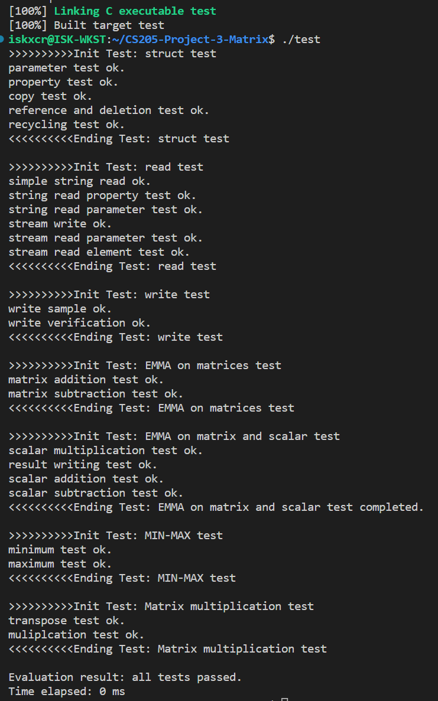

# CS205 C/C++ Programming - Lab Project 3 - Simple Matrix Library

**Name**: FANG Jiawei

**SID**: 12110804

## Part 1 - Analysis

The problem asks us to design a matrix library written in pure `C`. We are asked to design the functions to be *as safe as possible and be easy to use*. 

Since optimization is not very concerned (though some of simple optimizations are implemented), structure can be greatly simplified.

All the functions are designed to reduce possible branches by **using detailed comments to specify the range of valid inputs, the possible consequence upon error**, and the exact behavior of the function when such errors happen. Most functions are designed to return an enum type ``matrix_errno`` to indicate the status of the function, and uses passed pointers to return results (the same as how ``scanf`` does). Below is an example.

```C
/* Perform EleMent-by-eleMent Arithmetic (EMMA) operation on two matrices and store the result in a third matrix.
   The result matrix can refer to either op1 or op2 at the same time, but the pointer to the result matrix cannot be NULL.
   All operands, including the result, are supposed to be NULL or valid (i.e. created using function create_matrix()),
   so that an invalid pointer won't be dereferenced.
   If not, undefined behaviour will occur. If the result matrix isn't able to store the sum, i.e.,
   either it is NULL or the size doesn't match, the result matrix would be modified to match the need.

   If errors occurred during the operation (for example, operand size unmatches), do nothing on the result matrix.
   However, the user must handle 0 divisor error themselves.
   Returns the corresonding errno code upon failure. */
static matrix_errno
_do_emma_on_matrices(const matrix op1, const matrix op2, matrix *result, op_code code)
{
    // Ignored...
}
```

The exposed interfaces are left as clean as possible, leaving ``static`` detailed operations inside the ``matrix.c`` file.

The functions are designed to be error-prone and to recover from errors. In the above example, nothing would be done to ``*result`` when an error occurred.

## Part 2 - Code

All the functions explicitly in the requirements of the project are implemented. Please see ``matrix.h`` for a clear list of them. There are also some other functions that facilitate the utilization of this library for users.

Below is a part of the struct declaration for ``matrix``, and ``matrix_errno`` for error type.

```C
/* Struct and enum declarations */

/* Pointer to a matrix_struct */
typedef struct matrix_struct *matrix;

/* Matrix struct for storing elements of a matrix */
typedef struct matrix_struct
{
    /* Properties of a matrix */
    size_t rows; /* Number of rows */
    size_t cols; /* Number of columns */
    size_t refs;    /* Reference to this matrix */

    /* Linear array for storing actual elements. Access offset to the actual element
       is (r * cols + c), where r is row index and c is column index, all starting from 0. */
    float *arr;  

    /* For reuse of structs */
    struct matrix_struct *next; /* When this matrix is recycled, points to the next recycled element in a linked list. If not, next has garbage value */

} matrix_struct;

typedef enum matrix_errno
{
    COMPLETED = 1,     /* The whole operation completed successfully. */
    OUT_OF_MEMORY,     /* Out of memory upon operations */
    OP_NULL_PTR,       /* Null pointer in required operands */
    OP_INVALID,        /* Empty operand */
    OP_UNMATCHED_SIZE, /* Unmatched size of operands */
    OP_EXCEEDED_SIZE,  /* Size exceeded on requirement */
    UNIMPLEMENTED      /* Unimplemented operation */
} matrix_errno;
```

Below is an excerpt from ``matrix.c``.

```C
static matrix _recycled_list = NULL; /* Linked list of recycled matrices. Those recycled matrices have garbage values and should NEVER be used. */
```

```C
/* Test if a set of rows and cols exceeds the maximum float number size_t can represent. */
static inline int
_is_param_valid(const size_t rows, const size_t cols)
{
    return !(SZT_MAX / sizeof(float) < rows || SZT_MAX / sizeof(float) < cols || SZT_MAX / sizeof(float) / rows < cols);
}

/* Create a matrix based on given number rows and cols.

   If rows * cols exceeds the upper limit of size_t, or if rows and cols are completely invalid,
   or if no extra memory is available, return NULL. */
matrix create_matrix(const size_t rows, const size_t cols)
{
    /* Check parameters */
    if (rows == 0 || cols == 0 || !_is_param_valid(rows, cols))
        return NULL;

    matrix result; /* Store the result matrix */
    float *arr;    /* Store the result float array */

    if (_recycled_list != NULL) /* Reuse existing one first. */
    {
        result = _recycled_list;
        _recycled_list = _recycled_list->next;
    }
    else
    {
        result = (matrix)malloc(sizeof(matrix_struct));
        if (result == NULL)
        {
            out_of_memory();
            return NULL;
        }
    }
    arr = (float *)malloc(rows * cols * sizeof(float));
    if (arr == NULL)
    {
        out_of_memory();
        free(result);
        return NULL;
    }

    result->rows = rows;
    result->cols = cols;
    result->arr = arr;
    result->refs = 1;
    result->next = NULL;

    for (size_t i = 0; i < rows * cols; ++i)
        result->arr[i] = 0.0f;

    return result;
}
```

## Part 3 - Result & Verification

A detailed verification procedure is contained in the ``test.c`` file.

```C
/* Source file for matrix tests, containing all the built-in test rountines for the matrix library */
#include "matrix.h"

#include <stdio.h>
#include <stdlib.h>
#include <string.h>
#include <assert.h>
#include <math.h>
#include <time.h>

/* Definition for ease of use */

#define FLOAT_ERR 1e-7

/* Global variables */

static const size_t SZT_MAX = (size_t)-1;

/* Function prototypes */

void print_test_init(const char *s);
void print_test_end(const char *s);

void test_matrix_struct(void);
void test_matrix_read(void);
void test_matrix_write(void);
void test_emma_on_matrices(void);
void test_emma_on_matrix_and_scalar(void);
void test_min_max(void);
void test_matrix_mul_and_transpose(void);
void test_matrix_mul_performance(void);

void (*test_funcs[])(void) = {&test_matrix_struct,
                              &test_matrix_read,
                              &test_matrix_write,
                              &test_emma_on_matrices,
                              &test_emma_on_matrix_and_scalar,
                              &test_min_max,
                              &test_matrix_mul_and_transpose,
                              &test_matrix_mul_performance};

int main()
{
    clock_t clock3 = clock();
    size_t test_sz = sizeof(test_funcs) / sizeof(void (*)(void));
    for (size_t i = 0; i < test_sz; ++i)
        (*test_funcs[i])();
    printf("Evaluation result: all tests passed.\nTime elapsed: %ld ms\n", (clock() - clock3) * 1000 / CLOCKS_PER_SEC);
    return 0;
}

/* Definitions ignored for simplicity. Please see source code for details */
```

Result: 

```
iskxcr@ISK-WKST:~/CS205-Project-3-Matrix$ ./test
>>>>>>>>>>Init Test: struct test
parameter test ok.
property test ok.
copy test ok.
reference and deletion test ok.
recycling test ok.
<<<<<<<<<<Ending Test: struct test

>>>>>>>>>>Init Test: read test
simple string read ok.
string read property test ok.
string read parameter test ok.
stream write ok.
stream read parameter test ok.
stream read element test ok.
<<<<<<<<<<Ending Test: read test

>>>>>>>>>>Init Test: write test
write sample ok.
write verification ok.
<<<<<<<<<<Ending Test: write test

>>>>>>>>>>Init Test: EMMA on matrices test
matrix addition test ok.
matrix subtraction test ok.
<<<<<<<<<<Ending Test: EMMA on matrices test

>>>>>>>>>>Init Test: EMMA on matrix and scalar test
scalar multiplication test ok.
result writing test ok.
scalar addition test ok.
scalar subtraction test ok.
<<<<<<<<<<Ending Test: EMMA on matrix and scalar test completed. 

>>>>>>>>>>Init Test: MIN-MAX test
minimum test ok.
maximum test ok.
<<<<<<<<<<Ending Test: MIN-MAX test

>>>>>>>>>>Init Test: Matrix multiplication test
transpose test ok.
muliplcation test ok.
<<<<<<<<<<Ending Test: Matrix multiplication test

Evaluation result: all tests passed.
Time elapsed: 1 ms
iskxcr@ISK-WKST:~/CS205-Project-3-Matrix$ 
```

User can **easily customize test routines**, since there are some utility functions already implemented:

```C
matrix create_matrix(const size_t rows, const size_t cols);

void delete_matrix(matrix *m);

matrix_errno copy_matrix(matrix *dest, const matrix src);

matrix ref_matrix(const matrix m);

int test_equality(const matrix op1, const matrix op2, float ERR);

matrix_errno read_matrix_from_string(char *s, matrix *result);

matrix_errno read_matrix_from_stream(FILE *p, matrix *result);

matrix_errno print_matrix(FILE *p, const matrix src);
```


## Part 4 - Difficulties & Solutions

1. Floating-point arithmetic errors. The ``test_equality`` function provides a minimum error threshold for testing equalities between matrices.

2. Automated testing. Designing general cases and some corner cases to test all the parts of this program to ensure that the library won't fail in most situations. We implemented ``read_matrix_from_string()`` and ``read_matrix_from_stream()`` and ``test_equality()`` (as shown *above*) to facilitate this process. You can read matrix from files, compare the result with an existing matrix (the latter of which is how we have performed the test in ``test.c``). If time permits, more corner cases can be designed for testing. Also, a **time counter** is used to show the time elapsed during the test.

   

3. Maximize the utilization of memory: using ``size_t`` to access the adequate amount of memory:

   ```C
   /* Test if a set of rows and cols exceeds the maximum float number size_t can represent. */
   static inline int
   _is_param_valid(const size_t rows, const size_t cols)
   {
       return !(SZT_MAX / sizeof(float) < rows || SZT_MAX / sizeof(float) < cols || SZT_MAX / sizeof(float) / rows < cols);
   }
   ```

4. Reuse matrix structures:

   ```C
   static matrix _recycled_list = NULL; /* Linked list of recycled matrices. Those recycled matrices have garbage values and should NEVER be used. */
   
   static const size_t SZT_MAX = (size_t)-1; /* The maximum size of size_t */
   ```

5. How to simplify the test upon adding extra test routines? Use array of function pointers.

   ```C
   /* Function prototypes */
   
   void print_test_init(const char *s);
   void print_test_end(const char *s);
   
   void test_matrix_struct(void);
   void test_matrix_read(void);
   void test_matrix_write(void);
   void test_emma_on_matrices(void);
   void test_emma_on_matrix_and_scalar(void);
   void test_min_max(void);
   void test_matrix_mul_and_transpose(void);
   void test_matrix_mul_performance(void);
   
   void (*test_funcs[])(void) = {&test_matrix_struct,
                                 &test_matrix_read,
                                 &test_matrix_write,
                                 &test_emma_on_matrices,
                                 &test_emma_on_matrix_and_scalar,
                                 &test_min_max,
                                 &test_matrix_mul_and_transpose,
                                 &test_matrix_mul_performance};
   
   int main()
   {
       clock_t clock3 = clock();
       size_t test_sz = sizeof(test_funcs) / sizeof(void (*)(void));
       for (size_t i = 0; i < test_sz; ++i)
           (*test_funcs[i])();
       printf("Evaluation result: all tests passed.\nTime elapsed: %ld ms\n", (clock() - clock3) * 1000 / CLOCKS_PER_SEC);
       return 0;
   }
   ```

6. How to avoid checking for parameters that shouldn't exist when the input is reasonable? Specify all the possible inputs and consequences upon errors. The behavior should be deterministic and match the comments on the function.

7. How to utilize caches? (In a simple way) (Possibly by)

   ```C
   matrix trans2 = NULL; /* Store the transposed op2 */
       matrix_errno tr_res;  /* Store the transpose result */
   
       if ((tr_res = transpose_matrix(op2, &trans2)) != COMPLETED)
       {
           if (newarr == (*result)->arr) /* Else the result matrix is newly created, delete the result. */
               delete_matrix(result);
           else /* If the original result matrix is not empty, only free newarr */
               free(newarr);
           return tr_res;
       }
   ```

   Transpose one of the operands first to gain linear access. The intermediate result is also written in a linear way, and transposed later as the real result.

   **Test Matrix**: ``__matrix_lib_test.2``. Please see the attached file. Size ``2048 * 2048``.

   **Test Platform**: ``R7-5800H @3.20 GHz, 8C/16T``, ``DDR4-3200 Dual Channel``, ``Windows 10 for Workstation, version 22621.521`` 

   We provide code used here.

   ```C
   //Naive Brute-Force (NBF)
   for (size_t m = 0; m < op1->rows; m++)
   {
       for (size_t k = 0; k < op2->cols; k++)
       {
           float result = 0.0f;
           for (size_t n = 0; n < op1->cols; n++)
               result += op1->arr[m * op1->cols + n] * op2->arr[n * op2->cols + k];
           newarr[m * op2->cols + k] = result;
       }
   }
   ```

   ```C
   //Optimized Access Brute-Force (OABF)
   matrix trans2 = NULL; /* Store the transposed op2 */
   matrix_errno tr_res;  /* Store the transpose result */
   
   if ((tr_res = transpose_matrix(op2, &trans2)) != COMPLETED)
   {
       if (newarr == (*result)->arr) /* Else the result matrix is newly created, delete the result. */
           delete_matrix(result);
       else /* If the original result matrix is not empty, only free newarr */
           free(newarr);
       return tr_res;
   }
   
   size_t c_cnt = op1->cols; /* Cycle count */
   
   // implemented: transposed matrices (trans2, result) for faster access speed, loop designed to access elements linearly
   for (size_t k = 0; k < op2->cols; ++k)
   {
       for (size_t m = 0; m < op1->rows; ++m)
       {
           float result0 = 0;
           for (size_t n = 0; n < c_cnt; ++n)
           {
               result0 += op1->arr[m * c_cnt + n] * trans2->arr[k * c_cnt + n];
           }
           newarr[k * op1->rows + m] = result0;
       }
   }
   
   /* Clean up */
   delete_matrix(&trans2);
   /* ... */
   transpose_matrix(*result, result); /* Transpose the matrix since it's calculated in transposed form */
   ```

   ```C
   //OpenMP Optimized
   matrix trans2 = NULL; /* Store the transposed op2 */
   matrix_errno tr_res;  /* Store the transpose result */
   
   if ((tr_res = transpose_matrix(op2, &trans2)) != COMPLETED)
   {
       if (newarr == (*result)->arr) /* Else the result matrix is newly created, delete the result. */
           delete_matrix(result);
       else /* If the original result matrix is not empty, only free newarr */
           free(newarr);
       return tr_res;
   }
   
   size_t c_cnt = op1->cols; /* Cycle count */
   
   // todo: parallel optimization
   // implemented: transposed matrices (trans2, result) for faster access speed, loop designed to access elements linearly
   #pragma omp parallel for
   for (size_t k = 0; k < op2->cols; ++k)
   {
       #pragma omp parallel for
       for (size_t m = 0; m < op1->rows; ++m)
       {
           float result0 = 0;
           for (size_t n = 0; n < c_cnt; ++n)
           {
               result0 += op1->arr[m * c_cnt + n] * trans2->arr[k * c_cnt + n];
           }
           newarr[k * op1->rows + m] = result0;
       }
   }
   
   /* Clean up */
   delete_matrix(&trans2);
   /* ... */
   transpose_matrix(*result, result); /* Transpose the matrix since it's calculated in transposed form */
   ```

   ```C
   //Random matrix generator
   #include <stdio.h>
   #include <stdlib.h>
   #include <time.h>
   
   void print_mat(void)
   {
       int m = 2048, n = 2048;
       printf("%d %d\n", m, n);
       srand(time(NULL));
       for (int i = 0; i < m; ++i)
       {
           for (int j = 0; j < n; ++j)
               printf("%d ", rand());
           printf("\n");
       }
   }
   
   int main()
   {
       print_mat();
       print_mat();
   }
   ```

   

   | #Test Number | Calculation Method                  | Time Used (CPU Time in ms / High-Precision CPU Clock Unit) | Average in Group |
   | ------------ | ----------------------------------- | ---------------------------------------------------------- | ---------------- |
   | 1            | Naive Brute-Force (NBF)             | 43557 / -                                                  | 43425            |
   | 2            | Naive Brute-Force                   | 43362 / -                                                  | 43425            |
   | 3            | Naive Brute-Force                   | 43357 / -                                                  | 43425            |
   | 4            | Optimized Access Brute-Force (OABF) | 6973 / 880                                                 | 6954 / 890       |
   | 5            | Optimized Access Brute-Force        | 6926 / 904                                                 | 6954 / 890       |
   | 6            | Optimized Access Brute-Force        | 6964 / 887                                                 | 6954 / 890       |
   | 7            | OpenMP (Based on OABF)              | - / 245                                                    | - / 273          |
   | 8            | OpenMP (Based on OABF)              | - / 256                                                    | - / 273          |
   | 9            | OpenMP (Based on OABF)              | - / 319                                                    | - / 273          |

   For how the high-precision clock time is obtained and why is it that the unit is strange, the reason is that under WSL some high-precision clocks don't function as usual. Below we provide the code for obtaining the high-precision time. Notice that we use ```timespec`` here.

   ```c
   int main()
   {
       struct timespec start, end;
       clock_gettime(CLOCK_REALTIME, &start);
   
       size_t test_sz = sizeof(test_funcs) / sizeof(void (*)(void));
       for (size_t i = 0; i < test_sz; ++i)
           (*test_funcs[i])();
   
       clock_gettime(CLOCK_REALTIME, &end);
       printf("Evaluation result: all tests passed.\nTime elapsed: %ld unit\n", diff(start, end).tv_nsec / 1000000L);
       return 0;
   }
   
   /* Get the difference between two time.
      Reference: https://stackoverflow.com/questions/6749621/how-to-create-a-high-resolution-timer-in-linux-to-measure-program-performance */
   struct timespec diff(struct timespec start, struct timespec end)
   {
       struct timespec temp;
       if ((end.tv_nsec - start.tv_nsec) < 0)
       {
           temp.tv_sec = end.tv_sec - start.tv_sec - 1;
           temp.tv_nsec = 1000000000 + end.tv_nsec - start.tv_nsec;
       }
       else
       {
           temp.tv_sec = end.tv_sec - start.tv_sec;
           temp.tv_nsec = end.tv_nsec - start.tv_nsec;
       }
       return temp;
   }
   ```

8. How to reduce the possibility to have dangling pointers?

   (Frequently) Ask the user to pass the pointer to ``matrix`` as follows. After freeing, set the content to ``NULL``.

   ```C
   /* Free a matrix, assuming it is completely legal, or simply points to NULL, or is a null pointer.
      Otherwise, nothing is done. */
   void delete_matrix(matrix *m)
   {
       if (m == NULL || *m == NULL)
           return;
       if ((*m)->refs != 0)
           --((*m)->refs);
   
       /* If no more references exist */
       if ((*m)->refs == 0)
       {
           free((*m)->arr);
           (*m)->next = _recycled_list;
           _recycled_list = *m;
       }
   
       *m = NULL;
   }
   ```

   